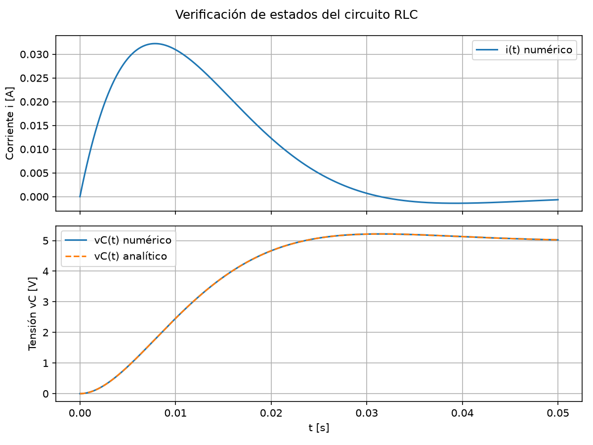
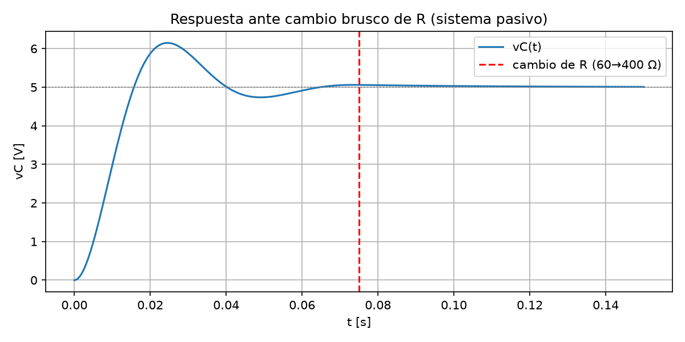
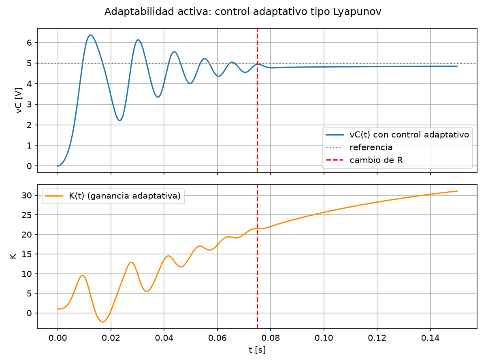
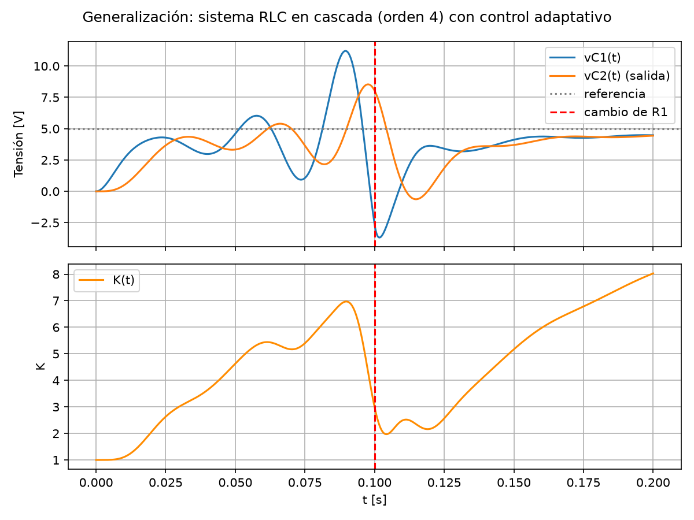

# ADAPTABILIDAD-RLC
# Comprobar Adaptabilidad — Sistema RLC
 
Trabajo práctico: simular un sistema RLC, verificar sus estados, argumentar
qué se entiende por **adaptabilidad**, y generalizar el resultado a un
sistema más complejo.
 
## Contenido
 
- [`rlc_simulation.py`](rlc_simulation.py) — todo el código (modelo, verificación,
  experimentos y generalización).
- [`outputs/`](outputs) — gráficos generados al correr el script.
Ejecutar:
 
```bash
pip install -r requirements.txt
python3 rlc_simulation.py
```
 
---
 
## 1. Ecuaciones diferenciales del circuito RLC (serie)
 
Aplicando la ley de tensiones de Kirchhoff a un RLC serie alimentado por
`Vin(t)`, con corriente `i` y tensión en el capacitor `vC`:
 
```
Vin = L di/dt + R i + vC
i   = C dvC/dt
```
 
En espacio de estados, con `x = [i, vC]ᵀ`:
 
```
dx/dt = A x + B u,      u = Vin
 
A = [ -R/L   -1/L ]      B = [ 1/L ]
    [  1/C     0  ]          [  0  ]
```
 
De la matriz `A` se obtienen la frecuencia natural y el factor de
amortiguamiento:
 
```
ωn   = 1 / sqrt(L C)
ζ    = (R/2) sqrt(C/L)
```
 
que clasifican la respuesta como sub-amortiguada (ζ<1), crítica (ζ=1) o
sobre-amortiguada (ζ>1).
 
## 2. Verificación de los estados
 
`verificar_estados()` resuelve el sistema numéricamente (`scipy.integrate.solve_ivp`)
ante una entrada escalón y lo compara contra la **solución analítica clásica**
del RLC serie (fórmula cerrada según el caso de amortiguamiento). El error
máximo obtenido es del orden de `1e-9 V`, es decir, la simulación numérica
reproduce fielmente la física del circuito.
 

 
## 3. ¿Qué se entiende por "adaptabilidad"?
 
En este trabajo se distinguen dos nociones que suelen confundirse:
 
- **Adaptabilidad pasiva (aparente):** cuando cambian los parámetros físicos
  del sistema (R, L o C — por ejemplo, envejecimiento de componentes o un
  cambio de carga), la respuesta también cambia, simplemente porque *la
  planta es otra*. El sistema no "decide" nada: no hay realimentación ni
  corrección. Esto se muestra en `adaptabilidad_pasiva()`: al subir R de
  60 Ω a 400 Ω el sistema pasa de sub-amortiguado (ζ=0.42) a sobre-amortiguado
  (ζ=2.83) sin ningún mecanismo que intente compensarlo.
  
- **Adaptabilidad activa (en sentido de control):** la definición que se
  argumenta como la correcta para hablar de "adaptabilidad" de un sistema es
  la **capacidad de un sistema de modificar su propio comportamiento (una
  ley de control, una ganancia, un parámetro interno) en tiempo real, a
  partir de la medición del error respecto a un objetivo, para mantener
  un desempeño deseado pese a cambios o incertidumbre en la planta**.
  Esto se implementa en `adaptabilidad_activa()` con un esquema tipo
  **control adaptativo por gradiente (MRAC simplificado / ley de Lyapunov)**:
```
  u(t)  = K(t) · e(t),        e(t) = Vref − vC(t)
  dK/dt = γ · e(t) · vC(t) − σ (K(t) − K0)
```
 
  El primer término de `dK/dt` es la ley de adaptación (ajusta K en la
  dirección que reduce el error); el segundo (σ-modificación) es una fuga
  estándar en control adaptativo que evita que la ganancia diverja sin
  límite. Al variar R a mitad de la simulación, la ganancia `K(t)` se
  reacomoda sola y el sistema vuelve a acercarse a la referencia, en lugar
  de simplemente "sufrir" el cambio como en el caso pasivo.
 
  
 
**Conclusión del argumento:** un sistema es *adaptable* no por el simple
hecho de responder distinto ante distintos parámetros (eso lo hace cualquier
sistema dinámico), sino cuando incorpora un mecanismo de realimentación que
ajusta su propia ley de control para preservar un objetivo (estabilidad,
error acotado, desempeño) ante cambios o incertidumbre que no fueron
anticipados de antemano.
 
## 4. Generalización a un sistema complejo
 
Para mostrar que el concepto no depende de que el sistema sea un RLC de 2
estados, se generaliza a un sistema de **orden 4**: dos etapas RLC en
cascada (la tensión del capacitor de la primera etapa alimenta a la
segunda), representado con la clase genérica `LTISystem` (que admite
cualquier `A`, `B` de dimensión `n`).
 
Se aplica exactamente el mismo esquema de control adaptativo (ley de
Lyapunov + σ-modificación) tomando como salida controlada la tensión del
segundo capacitor, mientras la resistencia de la primera etapa cambia a
mitad de camino:
 

 
El hecho de que la misma ley de adaptación —sin cambios estructurales—
logre corregir la salida de un sistema de mayor orden y más acoplado,
respalda la generalización: **la adaptabilidad, definida como mecanismo de
realimentación que ajusta parámetros de control en línea, es una propiedad
del esquema de control, no del tamaño ni de la complejidad particular de la
planta.** El mismo principio se extiende, en teoría, a sistemas de `n`
estados (redes RLC más grandes, sistemas mecánicos, térmicos, etc.)
representados en espacio de estados.
 
---
 
## Estructura del repositorio
 
```
rlc-adaptabilidad/
├── rlc_simulation.py     # todo el código
├── requirements.txt
├── README.md
└── outputs/               # gráficos generados por el script
    ├── 1_verificacion_estados.png
    ├── 2_adaptabilidad_pasiva.png
    ├── 3_adaptabilidad_activa.png
    └── 4_sistema_complejo_generalizado.png
```
